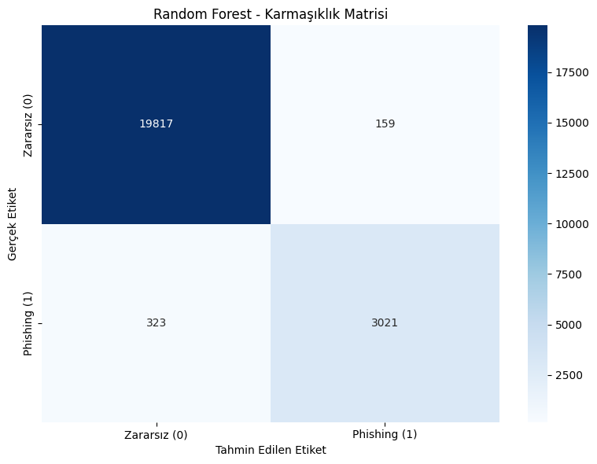
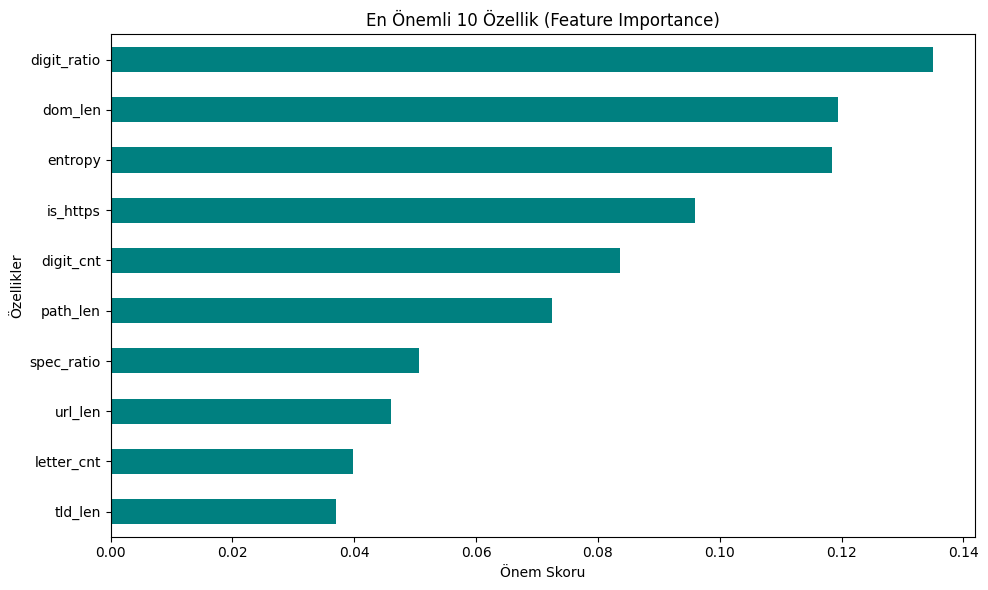
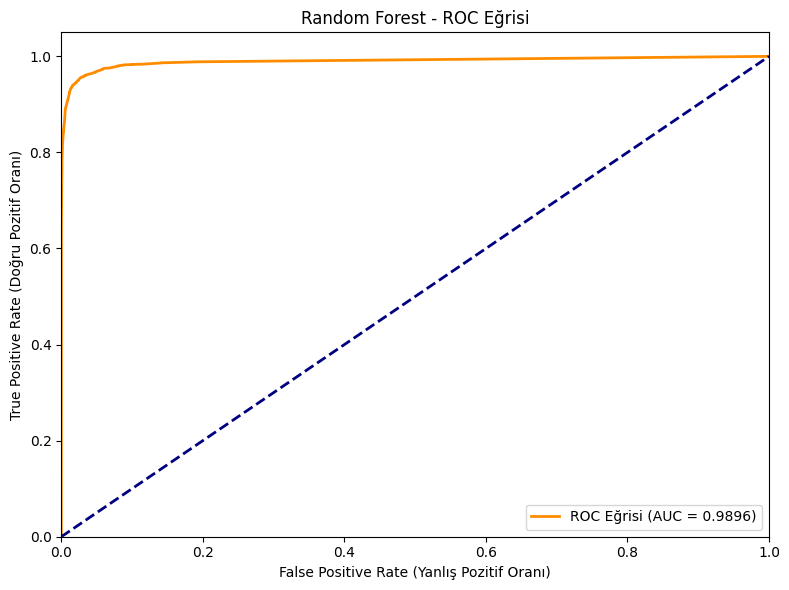

# URL Tabanlı Oltalama (Phishing) Tespiti ve Sınıflandırma Analizi

Bu proje, BLM0463 Veri Madenciliğine Giriş dersi kapsamında geliştirilmiştir. Çalışmanın temel amacı, zararsız (benign) ve oltalama (phishing) amaçlı URL'leri makine öğrenmesi teknikleri kullanarak tespit etmektir. 

Veri seti üzerinde çeşitli uzunluk ve oran metrikleri (özellik mühendisliği) analiz edilmiş olup, sınıflandırma modeli olarak **Random Forest (Rastgele Orman)** algoritması tercih edilmiştir.

---

## Model Performansı ve Metrikler

Eğitilen Random Forest modeli, oltalama sitelerini tespit etmede oldukça yüksek ve kararlı bir performans sergilemiştir. Modelin temel değerlendirme metrikleri aşağıdadır:

* **Accuracy (Doğruluk):** %97.93
* **Specificity (Özgüllük):** %99.20
* **Sensitivity (Duyarlılık):** %90.34
* **F-Measure (F1-Skoru):** %92.61
* **AUC Skoru:** 0.9896

*(Grafiklerin sorunsuz yüklenmesi için proje dizininde dosyaların bulunduğundan emin olunuz.)*

### 1. Karmaşıklık Matrisi (Confusion Matrix)
Modelin yüksek Specificity (%99.20) değeri sayesinde, zararsız bağlantıları yanlışlıkla oltalama olarak damgalama (False Positive) oranının ne kadar düşük olduğu matris üzerinde görülmektedir.

### 2. Özellik Önemi (Feature Importance)
Random Forest algoritmasının sınıflandırma kararı verirken en çok hangi URL özelliklerine ağırlık verdiğini gösteren analiz:

### 3. ROC Eğrisi
0.9896'lık AUC skoru, modelin iki sınıfı birbirinden ayırt etme kapasitesinin kusursuza yakın olduğunu doğrulamaktadır.

---

## Sonuçlar ve Literatür Karşılaştırması

Bu projede geliştirilen Random Forest modelinin sınıflandırma performansı, literatürdeki saygın akademik çalışmalarla karşılaştırmalı olarak analiz edilmiştir. Kendi eğittiğimiz modelde ulaştığımız **%97.93**'lük doğruluk (Accuracy) ve **0.9896**'lık AUC skoru, hem ScienceDirect (Elsevier) veri tabanında hem de MDPI'da yayımlanan güncel çalışmaların sonuçlarıyla güçlü bir örtüşme göstermektedir.

1. **ScienceDirect Literatür Uyumu:** ScienceDirect veri tabanında yayımlanan *"Machine learning based phishing detection from URLs"* başlıklı çalışmada, URL tabanlı oltalama tespitinde çeşitli makine öğrenmesi yöntemleri kıyaslanmış ve en başarılı sonuç **%97.98** doğruluk oranıyla yine Random Forest algoritması ile elde edilmiştir. Projemizde ulaştığımız %97.93'lük skor, global literatürdeki bu tepe noktasıyla sadece on binde beşlik bir farklılık göstermektedir.
2. **MDPI Literatür Uyumu:** Benzer şekilde, MDPI dergisinde yayımlanan *"Real-Time Phishing URL Detection Using Machine Learning"* isimli araştırmada da Random Forest algoritması **%99.99** doğruluk oranı ile en başarılı model olarak öne çıkmıştır. 

Elde ettiğimiz sonuçların literatürdeki bu referans noktalarına oldukça yakın olması; kullandığımız veri ön işleme adımlarının başarısını, modelin yüksek karar kararlılığını ve overfitting (aşırı öğrenme) sorununa karşı dirençli bir mimari kurulduğunu kanıtlamaktadır.

---

## Referanslar

*Rehman, A. U., Imtiaz, I., Javaid, S., & Muslih, M. (2025). Real-Time Phishing URL Detection Using Machine Learning. Engineering Proceedings, 107(1), 108. https://doi.org/10.3390/engproc2025107108
*Sahingoz, O. K., Buber, E., Demir, O., & Diri, B. (2019). Machine learning based phishing detection from URLs. *Expert Systems with Applications*, *117*, 345-357. https://doi.org/10.1016/j.eswa.2018.09.029

---

**Geliştirici:** Raul Namazzade
